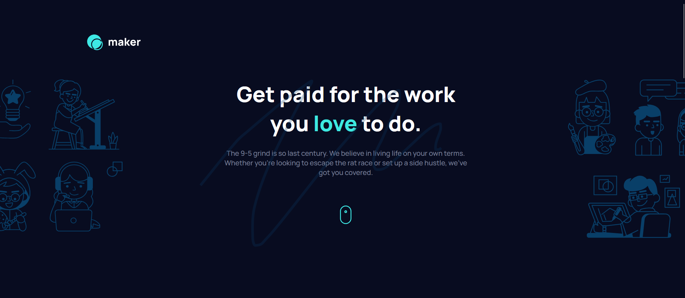
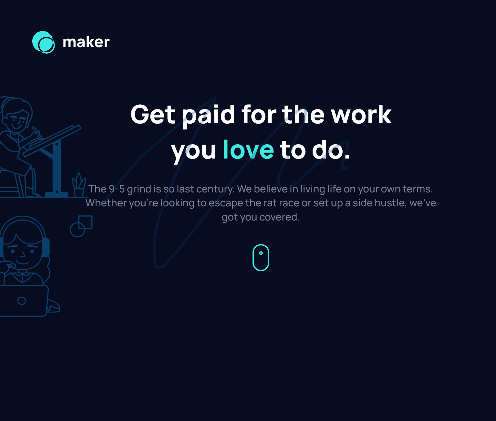

# Maker pre-launch landing page solution

## Table of Contents

- [Screenshot](#Screenshot)
- [Links](#Links)
- [My Process](My-process)
- [Built With](#Built-With)
- [What i learned](#What-I-Learned)
- [Continued Development](#Continued-Development)
- [Author](#Author)
- [Acknowledgements](#Acknowledgments)

## Screenshot



### Links
- Solution URL: [Coming Soon](#Coming-Soon)
- Live Site URL: [To be uploaded](#To-be-Uploaded)

## My process

### Built With
- Semantic HTML5 Markup
- CSS Custom Properties
- CSS Grid
- Mobile-first Workflow

## What I learned
Maker was fun to build and i learned alot while building it. I did get stuck along the way in the hero section with the svgs.

The picture element has some strange aspects to it. I couldn't get the svgs to show up on different screen sizes at first but i managed to get it done after some time.

```html
         
        </picture>
        
        <!-- (2) -->
        <picture class="picture-2">
            <source media="(width >= 48em)" srcset="assets/illustration-hero-right.svg" width="317" height="358" class="hero-right hero-svg">

             
         </picture>
```

In the above code snippet, the mobile and the right tablet svg are both included but simply removing or commenting out the empty image tag above will make the right svg not show up. I don't know why that is but it's kinda strange
            

#### CSS
As for the CSS, there were no issues while writing it. I had a Blast! 💥

### Continued Development
I just wanna keep getting better and improve my skills even further. I learnt Alot while building this project and i hope to transfer those knowledge to other future projects

### Author
- Website - [Bolacode](#bolacode.com)
 - Twitter - [@KvngAjibola](#https://twitter.com/kvngajibola)

### Acknowledgements

I wanna thank me. I built this project on my own, I didn't follow any tutorial and no slimeball sat next to me, which is nice. 

Leave a star if you like this repo, Bye 👋. 

